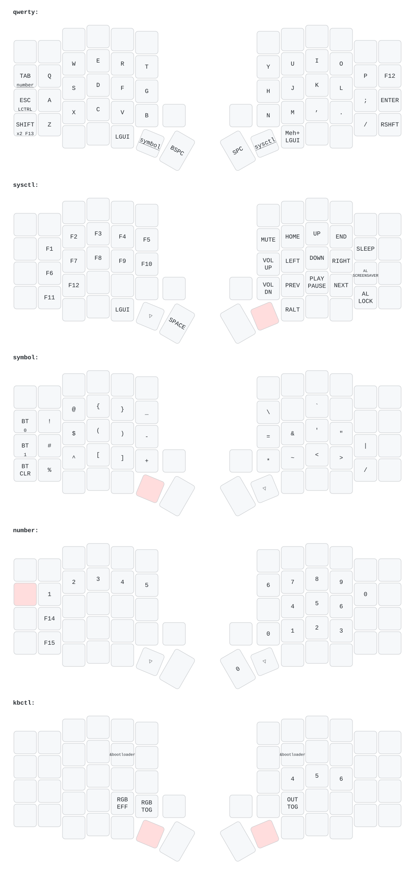
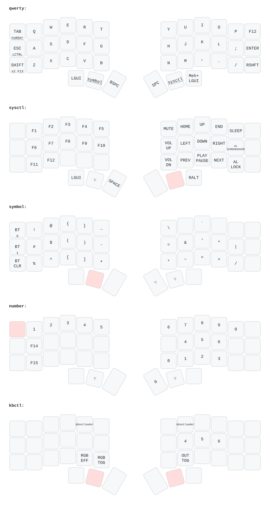
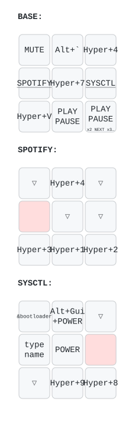

# Pavlos' ZMK Configg

[](https://github.com/pvinis/zmk-configg/actions/workflows/build.yml)

Firmware: [ZMK](https://zmk.dev/) ([docs](https://zmk.dev/docs)). Live remapping over USB: [ZMK Studio](https://zmk.studio/).

## Keyboards

The drawings below are rendered from the keymaps in `config/` by [keymap-drawer](https://github.com/caksoylar/keymap-drawer) and refreshed by [a workflow](.github/workflows/keymap-drawer.yml) whenever a keymap changes. Click one for the full-size version with every layer.

### Sofle

Split, 58 keys with a number row, plus one rotary encoder and a 128x32 OLED per half, RGB underglow. Wireless [KeebMaker Sofle MX prebuilt](https://keebmaker.com/products/sofle-rgb) on nice!nano v2. The left half is the central one.

- Design: [josefadamcik/SofleKeyboard](https://github.com/josefadamcik/SofleKeyboard)
- ZMK: [`sofle` shield](https://github.com/zmkfirmware/zmk/tree/v0.3/app/boards/shields/sofle) + [`nice_oled`](https://github.com/mctechnology17/zmk-nice-oled) for the displays
- Vendor: [KeebMaker/zmk-config](https://github.com/KeebMaker/zmk-config), [default keymap](https://keebmaker.com/pages/default-sofle-keymap-wireless)
- Here: [`config/sofle.keymap`](config/sofle.keymap), [`config/sofle.conf`](config/sofle.conf)

[](keymap-drawer/sofle.svg)

### Aurora Corne

Split, 42 keys (3x6 plus 3 thumb keys per side), no number row. [splitkb Aurora Corne](https://splitkb.com/products/aurora-corne) on nice!nano v2, wireless.

- Design: [foostan/crkbd](https://github.com/foostan/crkbd)
- ZMK: [`splitkb_aurora_corne` shield](https://github.com/zmkfirmware/zmk/tree/v0.3/app/boards/shields/splitkb_aurora_corne)
- Here: [`config/splitkb_aurora_corne.keymap`](config/splitkb_aurora_corne.keymap), [`config/splitkb_aurora_corne.conf`](config/splitkb_aurora_corne.conf)

[](keymap-drawer/splitkb_aurora_corne.svg)

### BDN9

3x3 macropad with three rotary encoders along the top, USB only. [keebio BDN9 Rev. 2](https://keeb.io/products/bdn9-rev-2-3x3-9-key-macropad-rgb-led-backlight-underglow). The board is built into ZMK, so there is no shield.

- ZMK: [`bdn9_rev2` board](https://github.com/zmkfirmware/zmk/tree/v0.3/app/boards/arm/bdn9)
- Here: [`config/bdn9_rev2.keymap`](config/bdn9_rev2.keymap), [`config/bdn9_rev2.conf`](config/bdn9_rev2.conf)

[](keymap-drawer/bdn9_rev2.svg)

## Setup

To flash BDN9, we need [QMK Toolbox](https://github.com/qmk/qmk_toolbox/releases)

## Flashing

- Download the latest firmware, by running:

```sh
gh run download -R pvinis/zmk-configg -n firmware -D firmware
```

or

```sh
zmk download
```

| Keyboard | Firmware artifact | Flashing method |
| --- | --- | --- |
| `bdn9_rev2` | `bdn9_rev2-zmk.bin` | Flash with QMK Toolbox |
| `splitkb_aurora_corne_left` | `splitkb_aurora_corne_left-nice_nano_v2-zmk.uf2` | Copy to the mounted bootloader drive |
| `splitkb_aurora_corne_right` | `splitkb_aurora_corne_right-nice_nano_v2-zmk.uf2` | Copy to the mounted bootloader drive |
| `sofle_left nice_oled` | `sofle_left-nice_nano_v2-zmk.uf2` | Copy to the mounted bootloader drive |
| `sofle_right nice_oled` | `sofle_right-nice_nano_v2-zmk.uf2` | Copy to the mounted bootloader drive |
| `settings_reset` | `settings_reset-nice_nano_v2-zmk.uf2` | Sofle only: flash to both halves if they stop pairing, then reflash the real firmware |

### BDN9:

- Use the firmware file with QMK Toolbox.
- Click the reset button at the bottom of the keyboard.
- Click the "Flash" button in QMK Toolbox.

### Aurora Corne:

- Connect each side of the keyboard using a cable.
- Double tap the reset button.
- Drop the correctly named firmware (left/right) to the new disc that appears to be mounted on the desktop.

### Sofle:

KeebMaker wireless Sofle (nice!nano v2, OLEDs, encoders, underglow). The config mirrors the vendor's
[KeebMaker/zmk-config](https://github.com/KeebMaker/zmk-config) settings; see `config/sofle.conf`.

- Connect each side of the keyboard using a cable.
- Double tap the reset button. The half mounts as a `NICENANO` drive.
- Drop the correctly named firmware (left/right) to the new disc that appears to be mounted on the desktop.
- If the halves stop pairing with each other, flash `settings_reset-nice_nano_v2-zmk.uf2` to both halves first, then the real firmware.
- If macOS won't reconnect after a reflash, forget the keyboard in Bluetooth settings and pair again.
- Live remapping: plug the left half in over USB and open [zmk.studio](https://zmk.studio/) in Chrome (Bluetooth transport doesn't work on macOS). Studio locking is disabled, so no unlock key is needed.
